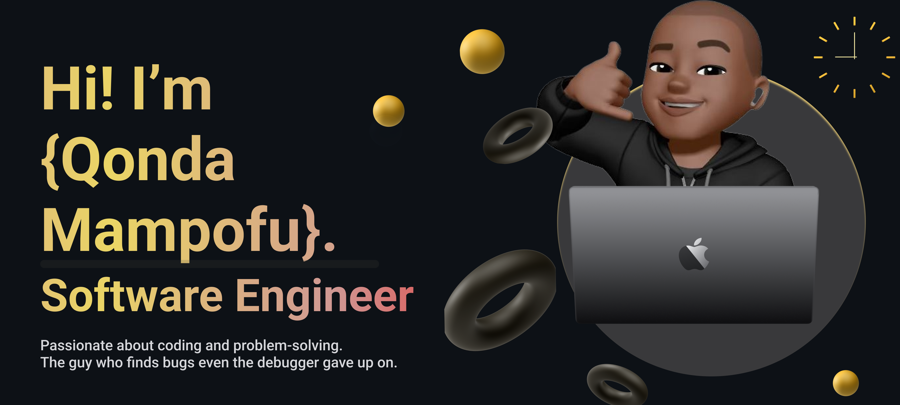

  

<h2 align="center">Qonda Mampofu</h2>
<h3 align="center">Software Engineer in Training | Full-Stack Developer</h3>
<h3 align="center">Passionate about building scalable applications and solving complex problems through code. Currently completing comprehensive software development training with expertise in both front-end and back-end technologies.</h3>

---

## Education & Training

**CodeSpace Academy** - *6-Month Software Development Program*  
- **Core Skills:** Full-stack development foundations, Object-Oriented Programming, Agile methodologies  
- **Front-end:** React.js, HTML5, CSS3, JavaScript ES6+  
- **Deployment & DevOps:** Application deployment and management  

**WeThinkCode_** - *Currently Enrolled*  
- **Back-end Development:** Node.js, Java, Python  
- **Advanced Programming:** Socket programming, multi-threading, test-driven development (TDD)  
- **Software Engineering Principles:** Advanced problem-solving and system design  

**Additional Training:** Scrimba, freeCodeCamp  

---

## Featured Projects

### Robot World Client-Server Game
**Tech Stack:** Java | Socket Programming | Multi-threading  
- Built a real-time multiplayer game with client-server architecture  
- Implemented concurrent connections and thread-safe game state management  
- [Repository Link](https://gitlab.wethinkco.de/qomampocpt024/brownfields_robot_worlds_cpt007.git)  

### Spam Detection System
**Tech Stack:** Python | Machine Learning | Data Processing  
- Developed an intelligent spam classification system  
- Applied machine learning algorithms for text analysis and pattern recognition  
- [Repository Link](https://gitlab.wethinkco.de/qomampocpt024/spam-detection.git)  

### Additional Projects
- **USSD Applications:** Mobile service applications with user interaction flows  
- **Various Coding Exercises:** Algorithm challenges and programming fundamentals  

---

## Technical Skills

### Frontend Development

   
  
  
  
  
  

### Backend Development
- **Languages:** Java, Python, Node.js  
- **Concepts:** Object-Oriented Programming, Socket Programming, Multi-threading  
- **Testing:** Test-Driven Development (TDD), Unit Testing  
- **Architecture:** Client-Server Applications, RESTful APIs  

### Development Tools & Methodologies

  
  

- **Version Control:** Git, GitLab, GitHub  
- **Methodologies:** Agile Development, TDD  
- **Deployment:** Application deployment and management  
- **Problem Solving:** Algorithm design, debugging, optimization  

---

## GitHub & GitLab

*Public repositories represent a portion of my work. Significant backend and enterprise projects are maintained in private academic repositories.*  

- [GitLab Profile](https://gitlab.wethinkco.de/qomampocpt024)  

---

## Let's Connect

  <a href="https://myportifolioweb.netlify.app/" target="_blank">
     Frontend Portfolio (CodeSpace)
  </a>
  &nbsp;&nbsp;&nbsp;
  

---

  <em>"Code is like humor. When you have to explain it, it's bad." - Cory House</em>

